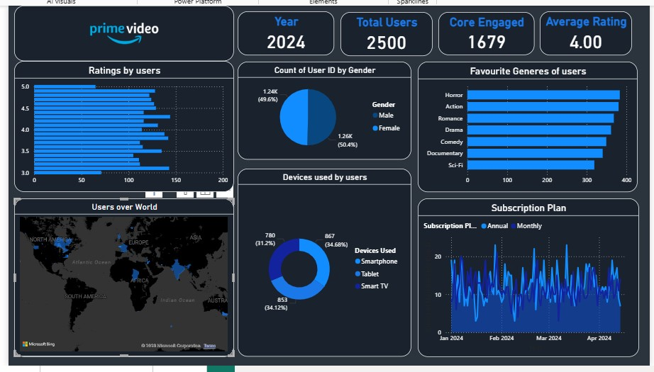
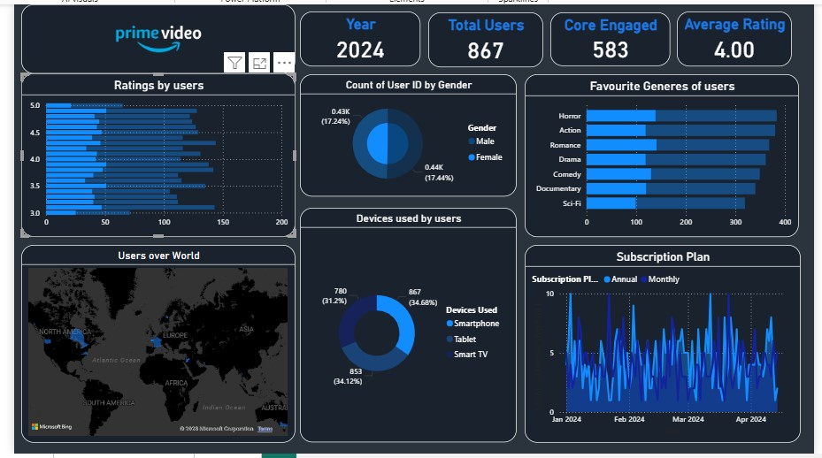
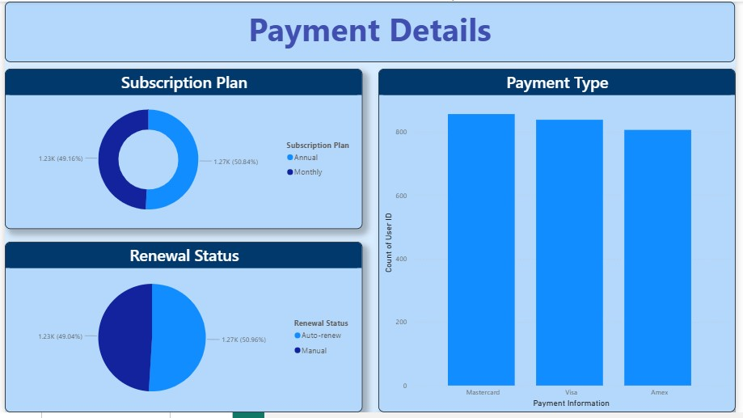
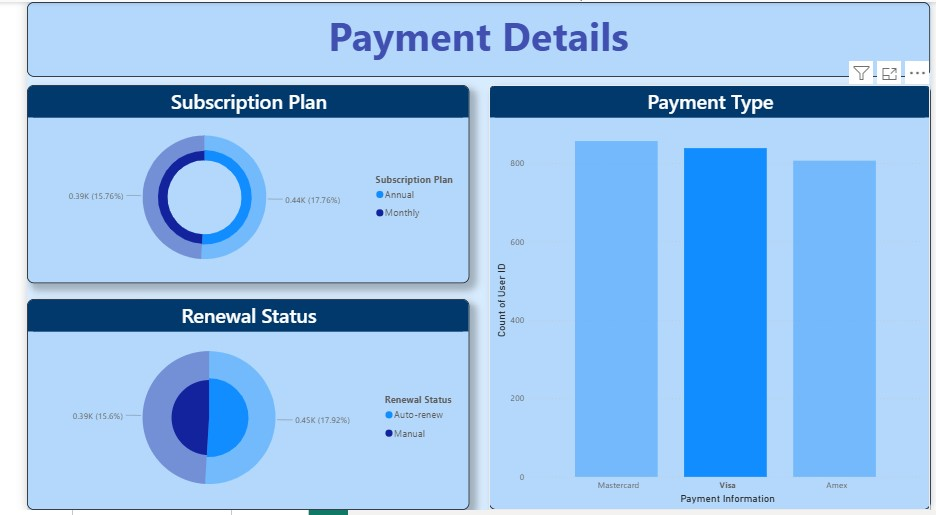

# 📺 Amazon Prime Video Analytics Dashboard 
# (Power BI Business Intelligence Project)

---

## 🔷 Project Summary

This project presents an interactive **Amazon Prime Video Analytics Dashboard** built using **Microsoft Power BI**.  
The objective of this analysis is to transform raw streaming platform data into actionable business insights that help understand **content performance, audience distribution, and platform growth trends**.

The dashboard allows stakeholders to quickly evaluate how content is distributed across genres, countries, release years, and audience ratings — helping streaming platforms make smarter content acquisition and production decisions.

This project simulates how a Data Analyst in an OTT company (like Amazon Prime Video / Netflix / Hotstar) would analyze platform content data and present it to business teams.

---

## 🎯 Business Problem

Streaming platforms host thousands of movies and TV shows.  
Without analysis, it becomes difficult to answer critical questions such as:

- What type of content dominates the platform?
- Which countries produce the most content?
- Is the platform movie-focused or series-focused?
- How has content growth changed over time?
- Which age-rating categories are most common?
- What genres should the platform invest in?

This dashboard converts raw catalog data into a visual decision-making tool for executives and product managers.

---

## 🧠 Business Use Case

This analysis can help a streaming company:

- Decide which genres to produce next
- Identify underrepresented markets
- Understand audience targeting
- Optimize content acquisition strategy
- Evaluate platform expansion opportunities

---

## 🛠 Tools & Technologies Used

- Microsoft Power BI Desktop
- Power Query – Data cleaning & transformation
- DAX (Data Analysis Expressions) – KPI & calculated measures
- Data Modeling – Relationships & schema design
- Interactive Visualization – Slicers & filters

---

## 📊 Dashboard Features

The dashboard includes:

- Content distribution by type (Movies vs TV Shows)
- Genre analysis
- Country-wise content production
- Release year trends
- Rating category analysis
- Interactive filters and slicers
- Dynamic visuals and KPI cards

---

## 📷 Dashboard Preview

### 🏠 Main Overview Dashboard

### 🎬 Content Type Distribution

### 🎭 Genre Analysis

### 📅 Payment Chart

### 🔞 Payment Chart Category

---

## 📈 Key Insights Extracted

- Movies dominate the platform catalog compared to TV shows
- Content production increased significantly after 2010
- Certain countries contribute majority of the platform’s content
- Drama and Documentary genres appear most frequently
- Most content falls under general audience and teen categories
- Platform expansion accelerated in recent years

---

## 📂 Dataset Information

The dataset contains information about Amazon Prime Video titles, including:

- Title Name
- Content Type (Movie / TV Show)
- Genre
- Country
- Release Year
- Duration
- Age Rating
- Cast & Directors

The dataset is used for **educational and portfolio demonstration purposes only**.

---

## 🔄 Data Processing Steps

- Imported dataset into Power BI
- Cleaned null and inconsistent values using Power Query
- Standardized country and genre fields
- Created relationships and data model
- Built calculated columns & DAX measures
- Designed interactive dashboard visuals
- Applied slicers and filters for user interaction

---

## 💡 Skills Demonstrated

- Data Cleaning
- Data Transformation
- Data Modeling
- DAX Calculations
- Dashboard Design
- Business Insight Extraction
- Storytelling with Data

---

## 🚀 How to Use the Project

1. Download the `.pbix` file from this repository
2. Open using Microsoft Power BI Desktop
3. Interact with filters and slicers
4. Explore different business questions using visuals

---

## 👨‍💻 Author

**Rupesh Desai**  
Aspiring Data Analyst  

**Skills:** SQL | Power BI | Excel | Python | Data Analysis | Data Visualization  

📧 Email: rupeshdesaiwork@gmail.com  
🔗 LinkedIn: https://www.linkedin.com/in/rupeshdesai2010/
